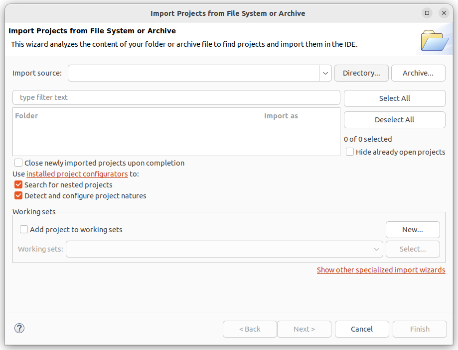
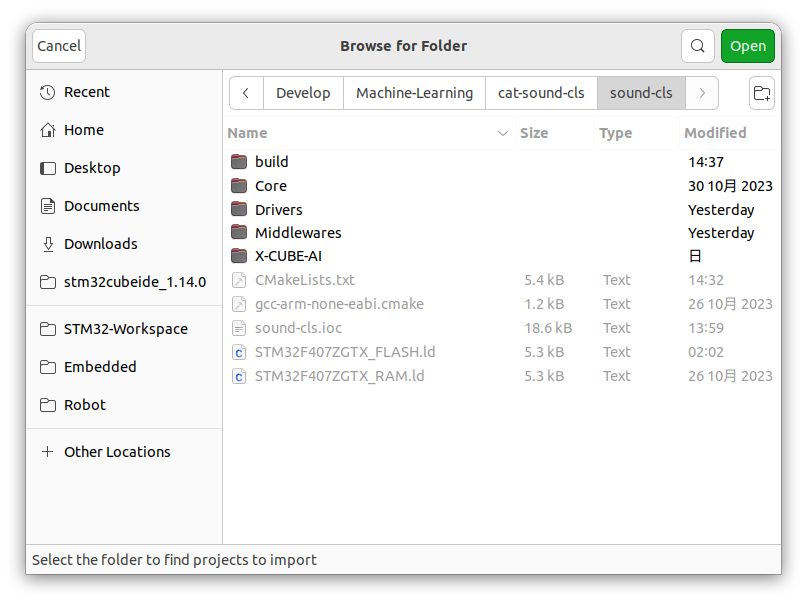
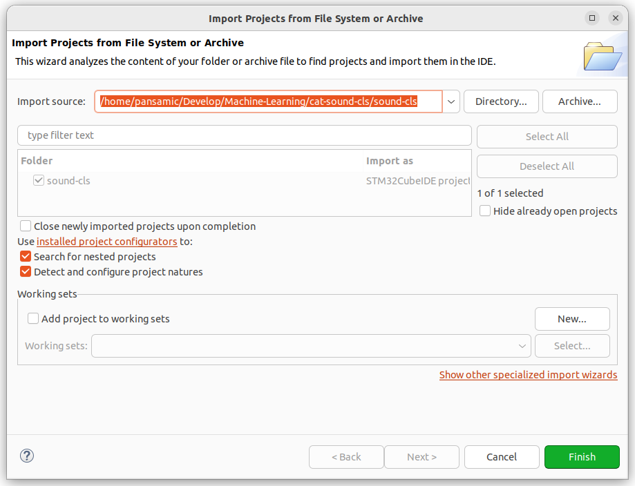
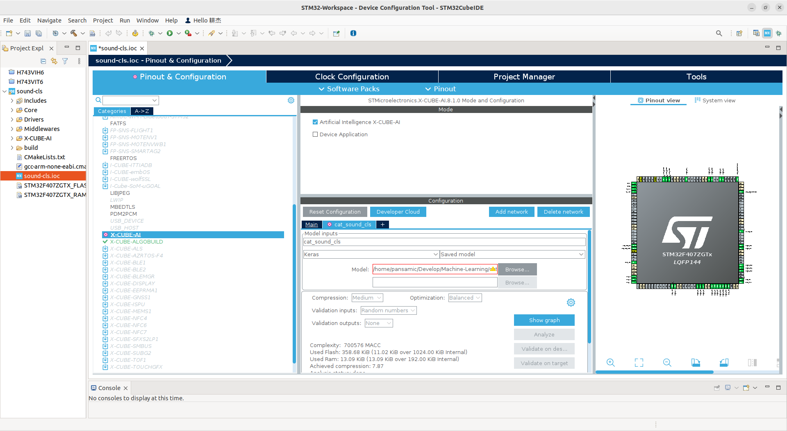
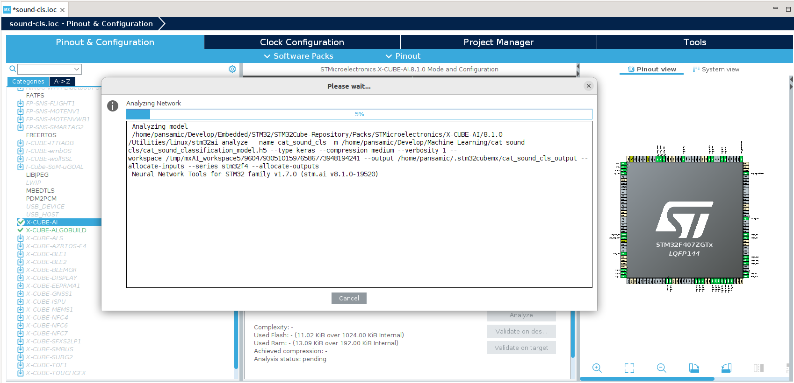
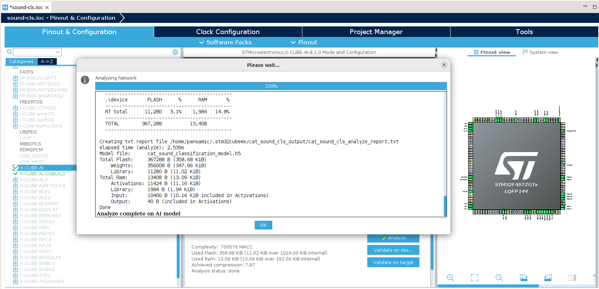

# cat sound classification training model

Software stack pipeline for cat sound classification evaluation board with STM32F407ZGT6, compatible with Geehy APM32F407ZGT6(C2 version).

## prerequisite

Install dependencies and toolchains.

```bash
sudo apt update && sudo apt install -y cmake make build-essential openocd gcc-arm-none-eabi gcc g++
```

Install python3 dependencies.

```bash
conda create python=3.10 -n cat-sound-cls
conda activate cat-sound-cls
pip3 install -r requirements.txt
```

## flash firmware

If you just want to use MCU device, just compile and flash firmware to MCU.

```bash
cd sound-cls
mkdir build && cd build
cmake ..
make -j
# use openocd to flash firmware
openocd -f interface/stlink.cfg -f target/stm32f4x.cfg -c "program sound-cls.elf verify reset exit"
```

## generate mfcc from wav audio

First compile and flash wav2mfcc-server firmware of MCU.
This code is for STM32F407ZGT6 or APM32F407ZGT6.
Connect USB port to your PC. wav2mfcc-server software uses USB FS CDC VCP to simulate a serial port.

```bash
# compile MCU firmware
cd wav2mfcc-server
mkdir build
cd build
cmake ..
make -j
# use openocd to flash firmware
openocd -f interface/stlink.cfg -f target/stm32f4x.cfg -c "program wav2mfcc-server.elf verify reset exit"
```

Put your wav files under `audio` folder. You'd better classify them into `test` and `train` subfolders.

```bash
mkdir build && cd build
cmake ..
make -j
# replace "/path/to/this/repo" with true path. full path is required.
./wa2v2mfcc-client -d /dev/ttyACM0 -b 921600 -p ../
```

## validate data

use python3 script to validate extracted audio data and MFCC params.

```bash
python3 script/validate_raw.py
python3 script/validate_mfcc.py
```
`validate_raw.py` will generate audio wave graph of every audio file.
`validate_mfcc.py` will also generate mfcc graphs.
You can check the figures of the data to examine whether the data is invalid.

## train model

After generating MFCC parameters, you can train yhe models.

Use `script/train.py` to train model as default option. You can rewrite train.py to fit your data.

A saved model file `cat_sound_classification_model.h5` will appear at root path of this repo.


## evaluation board examination

First compile and flash test firmware to evaluation board.

```bash
cd systest
mkdir build && cd build
cmake .. && make -j
openocd -f interface/stlink,cfg -f target/stm32f5x.cfg -c "program systest.elf verify reset exit"
```

then connect evaluation board and PC with linux PC with USB cable.
start examination program on PC.

```bash
cd build
cmake ..
make -j
./systest -d /dev/ttyACM0 -p ../
```


## deploy model on MCU

Download STM32CubeIDE or STM32CubeMX.

Click `File`->`Open Projects from File System` Import `sound-cls` project.

Click `Directory` button.


Choose this folder.


Click `Finish` button.


Click and open `.ioc` file and open `X-CUBE-AI` dialog.
Browse `cat_sound_classification_model.h5` we've just created.
Click `Analyze` button to analyze the model.







### use stm32cube-ai to generate model library.

Save `.ioc` file and update code.

### rebuild firmware

```bash
cd sound-cls/build
cmake ..
make -j
```